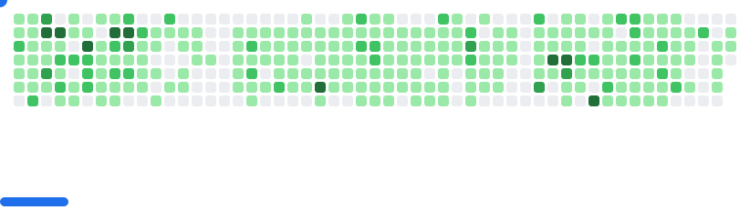

# Hi 👋, I'm Armaan

### A passionate full-stack developer who loves learning new things 🌲

## 🚀 About Me

- 🔭 I'm currently working on **[Rezen Gaming](https://rezengaming.com)**
- 🌱 I'm currently learning **React Native, Expo, C#, ASP.NET, and GraphQL**
- 👯 I'm looking to collaborate on **innovative web and mobile applications**
- 💬 Ask me about **React, React Native, JavaScript, TypeScript, and full-stack development**
- 📫 How to reach me: **[singharmaanbrar@gmail.com](mailto:singharmaanbrar@gmail.com)**
- ⚡ Fun fact: **I like trying new activities, and I love gaming**

---

## 🌐 Connect with Me

- **LinkedIn:** [linkedin.com/in/justarmaan](https://linkedin.com/in/justarmaan)
- **Portfolio:** [justarmaan.com](https://justarmaan.com)
- **Email:** [singharmaanbrar@gmail.com](mailto:singharmaanbrar@gmail.com)

---

## 🛠️ Tech Stack

### 💻 Programming Languages

  
  
  
  
  
  

### ⚛️ Frontend Technologies

  
  
  
  
  
  

### 🔧 Backend Technologies

  
  
  
  
  
  

### 🗄️ Databases & ORM

  
  
  
  
  
  

### ☁️ Cloud & DevOps

  
  
  
  
  

### 🔌 APIs & Tools

  
  
  
  
  
  

---

## 🚀 Featured Projects

### 🚗 [Relay](https://relay.arspera.com/)
> A rideshare app for parents to organize safe and reliable rides with trusted members in their community.

**Tech Stack:** React Native, Expo, GraphQL, Firebase, TypeScript
🔗 **Links:** [Landing Page](https://relay.arspera.com/) | [GitHub](https://github.com/byrondray/relay)

**Key Features:**
- 🛡️ Safe community-based ridesharing for kids
- 📱 Cross-platform mobile application
- 🔐 Secure authentication and user verification
- 📍 Real-time location tracking and notifications

---

### 🤖 [Discord Troll Bot](https://github.com/JustArmaan/trollbot)
> A fun Discord bot with trolling features and interactive commands for your server.

**Tech Stack:** Node.js, Discord.js, JavaScript
🔗 **Links:** [GitHub Repository](https://github.com/JustArmaan/trollbot)

**Key Features:**
- 🎮 Interactive gaming commands
- 🎭 Fun trolling features for server entertainment
- ⚡ Fast response times and reliable uptime
- 🔧 Easy setup and configuration

---

## 📊 GitHub Analytics

  
  

---

## 📫 Let's Connect!

I'm always excited to collaborate on innovative projects and connect with fellow developers. Feel free to reach out!

  **💌 Email:** [singharmaanbrar@gmail.com](mailto:singharmaanbrar@gmail.com)
  **💼 LinkedIn:** [linkedin.com/in/justarmaan](https://linkedin.com/in/justarmaan)
  **🌐 Portfolio:** [justarmaan.com](https://justarmaan.com)

---
<picture>
  <source
    media="(prefers-color-scheme: dark)"
    srcset="images/breakout-dark.svg"
  />
  <source
    media="(prefers-color-scheme: light)"
    srcset="images/breakout-light.svg"
  />
  
</picture>
