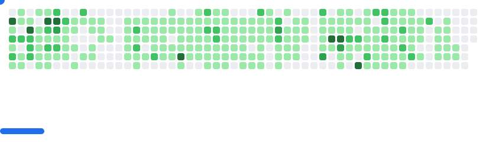

# Hi 👋, I'm Armaan

### A passionate full-stack developer building impactful web and mobile applications 🚀

## 🚀 About Me

- 🔭 I'm currently building **[Rezen Gaming](https://rezengaming.com)** - a competitive esports wagering platform
- 🌱 I'm currently learning **React Native, Expo, C#, ASP.NET, and GraphQL**
- 👯 I'm looking to collaborate on **innovative web and mobile applications**
- 💬 Ask me about **React, Next.js, TypeScript, and full-stack development**
- 📫 How to reach me: **[singharmaanbrar@gmail.com](mailto:singharmaanbrar@gmail.com)**
- ⚡ Fun fact: **I love trying new activities and gaming competitively**

---

## 🌐 Connect with Me
 

  
  
  

---

## 🛠️ Tech Stack
 
### 💻 Programming Languages

  
  
  
  
  
  

 
### ⚛️ Frontend Technologies

  
  
  
  
  

 
### 🔧 Backend Technologies

  
  
  
  
  
  

 
### 🗄️ Databases & ORM

  
  
  
  
  
  

 
### ☁️ Cloud & DevOps

  
  
  
  
  

---

## 🚀 Featured Projects

### 🎮 [Rezen Gaming](https://rezengaming.com)
> A competitive esports wagering platform where players compete in skill-based challenges and earn real rewards.

**Tech Stack:** Next.js, TypeScript, Drizzle ORM, AWS Lambda, PostgreSQL  
🔗 **Links:** [Live Site](https://rezengaming.com)

**Key Features:**
- 💰 Real-money wagering system with secure wallet transactions
- 🏆 Match creation and team management systems
- 🎥 Twitch, Xbox, and Steam API integrations for live streaming
- 🛡️ Built with scalability and security in mind

---

### 🚗 [Relay](https://relay.arspera.com/)
> A rideshare app for parents to organize safe and reliable rides with trusted members in their community.

**Tech Stack:** React Native, Expo, GraphQL, Firebase, TypeScript  
🔗 **Links:** [Landing Page](https://relay.arspera.com/) | [GitHub](https://github.com/byrondray/relay)

**Key Features:**
- 🛡️ Safe community-based ridesharing for kids
- 📍 Real-time GPS tracking and PIN verification
- 🤖 AI-powered ride notifications
- 📱 Cross-platform mobile application

---

### 🧠 [West Coast Healthy Memory Society](https://wchealthymemory.com/en/)
> A web platform helping staff generate AI-powered cognitive training activities for seniors with Alzheimer's.

**Tech Stack:** Next.js, TypeScript, MySQL, Drizzle ORM, OpenAI API  
🔗 **Links:** [Live Site](https://wchealthymemory.com/en/)

**Key Features:**
- 🤖 AI-powered personalized content generation
- ♿ Senior-friendly accessible UI design
- 📚 Cognitive training activity library
- 👥 Built for nonprofit community impact

---

### 🤖 [Discord Troll Bot](https://github.com/JustArmaan/trollbot)
> A fun Discord bot with trolling features and interactive commands for your server.

**Tech Stack:** Node.js, Discord.js, JavaScript  
🔗 **Links:** [GitHub Repository](https://github.com/JustArmaan/trollbot)

**Key Features:**
- 🎮 Interactive gaming commands
- 🎭 Fun server entertainment features
- ⚡ Fast response times and reliable uptime
- 🔧 Easy setup and configuration

---

## 📊 GitHub Analytics

  <!--  -->
  

---

## 📫 Let's Connect!

I'm always excited to collaborate on innovative projects and connect with fellow developers. Feel free to reach out!

  **💌 Email:** [singharmaanbrar@gmail.com](mailto:singharmaanbrar@gmail.com)  
  **💼 LinkedIn:** [linkedin.com/in/justarmaan](https://linkedin.com/in/justarmaan)  
  **🌐 Portfolio:** [justarmaan.com](https://justarmaan.com)

---

<picture>
  <source
    media="(prefers-color-scheme: dark)"
    srcset="images/breakout-dark.svg"
  />
  <source
    media="(prefers-color-scheme: light)"
    srcset="images/breakout-light.svg"
  />
  
</picture>
